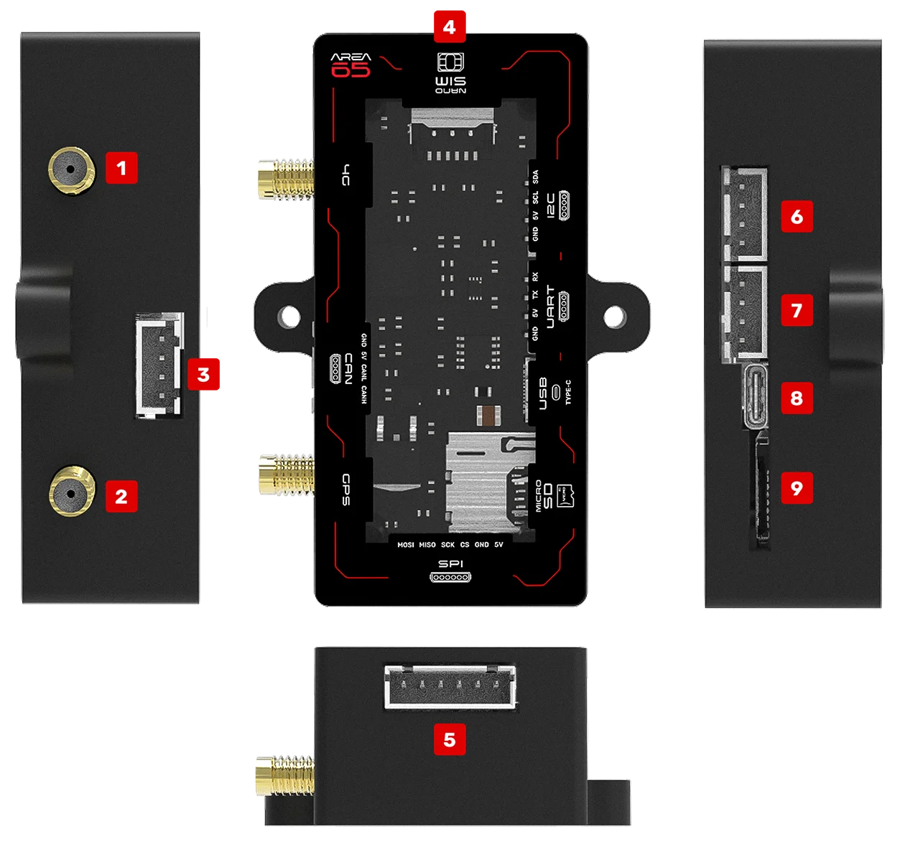

Hardware Integration
====================

Interface Options
-----------------

The AREA65 module supports four communication interfaces that can operate simultaneously.

UART (TTL, 5V)
^^^^^^^^^^^^^^

+-----+----------+
| Pin | Function |
+=====+==========+
| TX  | Transmit |
+-----+----------+
| RX  | Receive  |
+-----+----------+
| GND | Ground   |
+-----+----------+
| VCC | 5V Power |
+-----+----------+

**Baud Rate:** 57600 (fixed, Spectronik FC compliant)

CAN 2.0
^^^^^^^

+---------+----------+
| Pin     | Function |
+=========+==========+
| CAN_H   | CAN High |
+---------+----------+
| CAN_L   | CAN Low  |
+---------+----------+
| GND     | Ground   |
+---------+----------+

**Protocol:** CAN 2.0A/B
**Speed:** Configurable

SPI (TTL, 3.3V)
^^^^^^^^^^^^^^^

+------+------------------+
| Pin  | Function         |
+======+==================+
| MOSI | Master Out Slave In |
+------+------------------+
| MISO | Master In Slave Out |
+------+------------------+
| SCK  | Serial Clock     |
+------+------------------+
| CS   | Chip Select      |
+------+------------------+
| GND  | Ground           |
+------+------------------+

**Voltage:** 3.3V TTL

I2C (TTL, 3.3V)
^^^^^^^^^^^^^^^

+-----+------------+
| Pin | Function   |
+=====+============+
| SDA | Serial Data|
+-----+------------+
| SCL | Serial Clock|
+-----+------------+
| GND | Ground     |
+-----+------------+

**Voltage:** 3.3V TTL
**Address:** Configurable

Power Requirements
------------------

+-----------+-------------+
| Parameter | Value       |
+===========+=============+
| Voltage   | 5V DC       |
+-----------+-------------+
| Current   | 1A minimum  |
+-----------+-------------+
| Connector | USB-C or interface pins |
+-----------+-------------+

Mechanical Dimensions
---------------------

+-----------+------------+
| Dimension | Value (mm) |
+===========+============+
| Length    | 78         |
+-----------+------------+
| Width     | 57         |
+-----------+------------+
| Height    | 24         |
+-----------+------------+
| Weight    | 45g        |
+-----------+------------+
| Mounting Holes | 2x Ø3.3mm through holes |
+-----------+------------+

Connector Pinout
----------------

The AREA65 module features the following hardware interfaces:

+---+-------------+---------------------------------------------+
| # | Interface   | Description                                 |
+===+=============+=============================================+
| 1 | 4G SMA      | 4G cellular antenna connector               |
+---+-------------+---------------------------------------------+
| 2 | GPS SMA     | GPS antenna connector                       |
+---+-------------+---------------------------------------------+
| 3 | CAN         | CAN 2.0 bus interface                       |
+---+-------------+---------------------------------------------+
| 4 | Nano SIM    | Nano SIM card slot for cellular connectivity|
+---+-------------+---------------------------------------------+
| 5 | SPI         | SPI interface (3.3V TTL)                    |
+---+-------------+---------------------------------------------+
| 6 | I2C         | I2C interface (3.3V TTL)                    |
+---+-------------+---------------------------------------------+
| 7 | UART        | UART interface (TTL, 5V)                    |
+---+-------------+---------------------------------------------+
| 8 | USB-C       | USB-C connector for power and data          |
+---+-------------+---------------------------------------------+
| 9 | MicroSD     | MicroSD card slot for data logging          |
+---+-------------+---------------------------------------------+

Arduino Integration
-------------------

For Arduino-based projects, use the Area65Sender library:

1. Install the library from ``arduino_libraries/area65sender.zip``
2. Connect to the UART interface (TX, RX, GND, 5V)
3. Use ``SoftwareSerial`` for flexible pin assignment
4. Configure baud rate to 57600

See the :doc:`arduino-library` documentation for complete usage examples.
